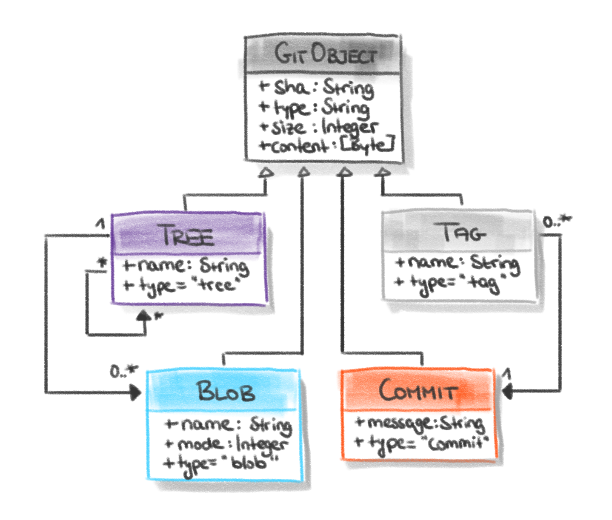
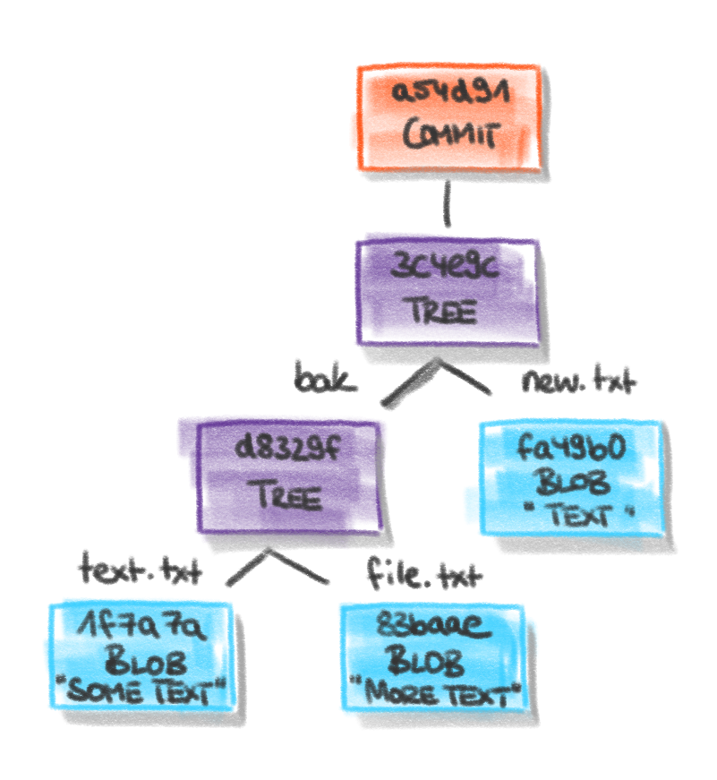
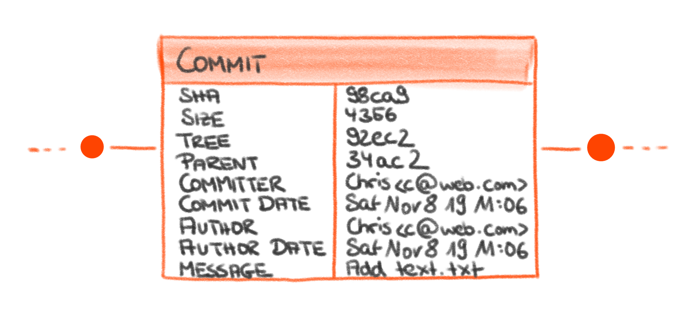
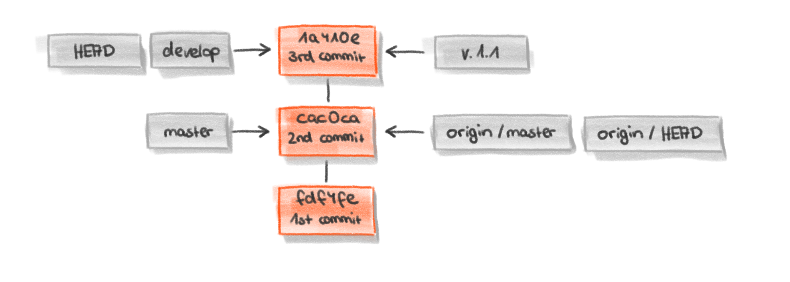

# Architektur und Datentypen

## Architektur

### Quellen

## Datentypen und References

### Beschreibung der Datentypen

#### blob
* Ähnlich einer Datei
* Aber: Dateiname wird nicht gespeichert!
* Inhalt von blob-Objekten
    * Objekttyp "blob"
    * SHA-1-Wert
    * Inhalt der Datei
    
#### tree
* Ähnlich zu einem UNIX-Ordner
* Inhalt von tree-Objekten
    * Objekttyp "tree"
    * SHA-1-Wert
    
#### commit

* Führt mehrere trees und blobs zu einer Art Snapshot-Objekt zusammen
* Commits werden dabei chronologisch sortiert
* Inhalt von commit-Objekten
    * Objekttyp "commit"
    * SHA-1-Wert vom root-tree-Objekt
    * SHA-1-Wert vom parent-commit-Objekt
    * Autor
    * Datum (Autor)
    * Committer
    * Datum (Comnmitter)
    * Commit-Message
    
#### tag
* Eine Art Pointer auf einen bestimmten Commit
* Ein bestimmter Commit kann durch einen annotierten Tag leichter wiedergefunden werden
* Inhalt von tag-Objekten
    * Objekttyp "tag"
    * SHA-1-Wert des Objektes, an das das Tag gesetzt wird
    * Objekttyp des Objektes, an das das Tag gesetzt wird
    * Tag-Name
    * Autor
    * Datum (Autor)
    * Tag-Message
    
### Git-References

### Quellen
* [Git Documentation: Git Internals - Git Objects](https://git-scm.com/book/en/v2/Git-Internals-Git-Objects)
* [Git Documentation: Git Internals - Git References](https://git-scm.com/book/en/v2/Git-Internals-Git-References)
* [Git Object Types](https://matthew-brett.github.io/curious-git/git_object_types.html)