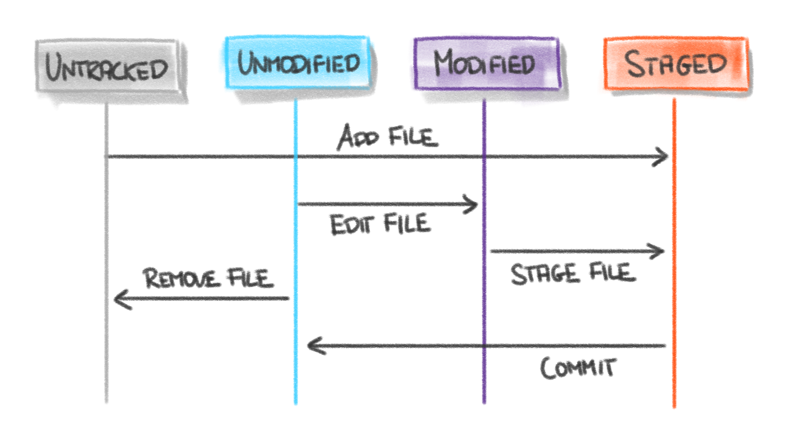

# Workflow

## Arbeitsweise von Git

* Dateien liegen in Repositories (Verzeichnissen)
* Änderungen in Arbeitskopie
* Checkout: Version aus Repo in Arbeitskopie übertragen
* Commit: Änderungen der Arbeitskopie in Repo übertragen
* verteilte Versionsverwaltung: jeder verfügt über lokale Kopie des Repos

## Abläufe in Git
### Datei-Workflow

* unversionierte Datei kann zur Versionskontrolle hinzugefügt werden (staged)
* versionierte Dateien werden in unverändert und verändert unterteilt
* unveränderte Dateien können verändert werden
* veränderte Dateien können staging Bereich (für commit) hinzugefügt werden
* staging Bereich kann commited werden -> dann zählen wieder alle Dateien als unverändert
* Branches können jederzeit erstellt werden und erleichtern die Teamarbeit

### Quellen
* Bildquellen:
    * [Git-Lifecycle-git-scm](https://git-scm.com/book/en/v2/Git-Basics-Recording-Changes-to-the-Repository)
* [Git Internals - Plumbing and Porcelain](https://git-scm.com/book/en/v2/Git-Internals-Plumbing-and-Porcelain)
* [Versionsverwaltung  mit  Git](http://www.mi.fu-berlin.de/wiki/pub/AgMathLife/SoftWareProjectSS16/Praesentation_git.pdf)
* [Two sides of Git: plumbing and porcelain](https://subscription.packtpub.com/book/application_development/9781849517522/8/ch08lvl1sec82/two-sides-of-git-plumbing-and-porcelain)
* [Git: An introduction of plumbing and porcelain commands](https://de.slideshare.net/th507/git-an-intro-of-plumbing-and-porcelain-commands)

## Arbeiten mit Git

### Plumbing and Porcelain
* plumbing commands: Unterkommandos, steuern low-level Operationen, bilden die Basis
* porcelain commands: rufen plumbing commands auf höherem Level auf, nutzerfreundlich, bilden quasi Abkürzung für lange plumbing commands
* Bsp: git status = git ls-files --exclude-per-directory=.gitignore -exclude-from=.git/info/exclude -others --modified -t
* Ähnlichkeiten zum Facade-Entwurfsmuster
    * Der User nutzt fast nur Porcelain-Kommandos
    * Nur in Ausnahmefällen werden Plumbing-Kommandos verwendet (händische/tiefe Eingriffe, nie normale Git-Nutzung!)
    * Porcelain-Kommandos rufen in der inneren Struktur von Git Plumbing-Kommandos auf

### lokales Repository erhalten
#### git init
* git-Repository in lokalem Verzeichnis anlegen 

#### git clone [Link]
* git-Repository von woanders (Link) klonen

### Änderungen zum Repository hinzufügen
#### git status
* Status/Zustand der Dateien prüfen
* zeigt Dateien, die unversioniert oder versioniert und bearbeitet sind
* gibt aktuellen Branch an

#### git diff
* Änderungen detailliert ansehen (geänderte Zeilen)

#### git add
* Dateien oder Änderungen zur Versionskontrolle hinzufügen

#### git commit
* Änderungen zum lokalen Repository hinzufügen
* erstellt "Schnappschuss" des Projektes zu aktuellem Zeitpunkt
* commits bilden Zustände, die später wieder hergestellt werden können

#### git rm
* Dateien aus Versionskontrolle entfernen
* zusätzliches Entfernen aus Working Directory

### Arbeiten mit Remote-Repository
#### git fetch
* lädt alle Daten aus Remote-Repository herunter, die lokal noch nicht vorhanden sind (ohne zu mergen)

#### git pull
* lädt Updates herunter und merged sie in lokales Repo

#### git push
* Updates ins Remote-Repository übertragen

### Ähnlichkeiten zu bekannten Architekturmustern
* Client-Server
    * Das Zusammenspiel zwischen remote- und local-Repository kann als Client-Server-Model angesehen werden
    * Mithilfe von z.B. git pull wird ein Request zum Webserver (z.B. GitHub) gesendet, auf dem das remote-Repository liegt
    * Als Antwort kann der Webserver den Request entweder akzeptieren oder ablehnen
* Peer-to-Peer
    * Zwischen mehreren entfernten Repositories besteht eine Art Peer-to-Peer-Netzwerk

### Quellen
* Bildquellen:
    * [Git Tutorial – Commands And Operations In Git](https://www.edureka.co/blog/git-tutorial/)
* [Einführung in Git (Teil 1): Versionsverwaltung](https://www.mittwald.de/blog/webentwicklung-design/webentwicklung/versionsverwaltung-einfuhrung-in-git-teil-1)
* [Git Basics - Getting a Git Repository](https://git-scm.com/book/en/v2/Git-Basics-Getting-a-Git-Repository)
* [Git Basics - Recording Changes to the Repository](https://git-scm.com/book/en/v2/Git-Basics-Recording-Changes-to-the-Repository)
* [Git Basics - Working with Remotes](https://git-scm.com/book/en/v2/Git-Basics-Working-with-Remotes)
* [Architecture of Open-Source-Software (Git)](https://www.aosabook.org/en/git.html)
* [Client-Server Model](https://techterms.com/definition/client-server_model)
